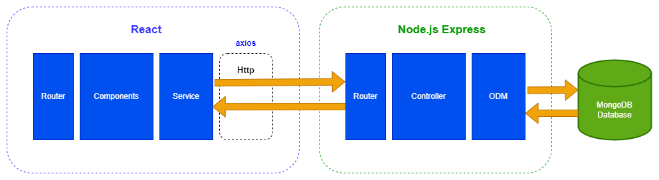

# PlumbEase Developer Documentation

## Introduction

PlumbEase is a full-stack web application built on the MERN (MongoDB, Express.js, React.js, Node.js) stack, aiming to streamline plumbing services. Its core functionality includes enabling clients to discover plumbing experts, make service offers, and negotiate appointments.

PlumbEase facilitates seamless communication between clients and plumbers, ensuring efficient scheduling and task completion in plumbing services.

### Repository Structure

The PlumbEase application follows a monorepo architecture, where both backend and frontend codebases are organized within the same repository. Below is the structure of the monorepo:

```
  plumbing-services/
  │
  ├── backend/ # Backend codebase
  │ ├── index.js # Entry point for the backend server
  │ ├── ... # Other backend files and directories
  │
  └── frontend/ # Frontend codebase
  ├── public/ # Static assets and HTML template
  ├── src/ # React components, pages, and other frontend files
  ├── ... # Other frontend files and directories

```

1. **Clone the Repository:**

```bash
   git clone https://github.com/janibyekb/plumbing-services.git
```

2. **Install dependencies and start the server:**

```bash
  $ npm install
  $ npm run dev
```

## Architecture



### Main Components

**Client-Side:**

- **React.js:** Handles user interface components and user interactions, providing a dynamic and responsive user experience.
- **Redux:** Manages the application state, ensuring consistency across components and facilitating data flow between them.
- **Tailwind CSS:** Utilized for styling and layout, enabling rapid development and customization of UI elements.
- **Material-UI with Tailwind CSS:** Integrates Material-UI components with Tailwind CSS for enhanced UI design and consistency.

**Server-Side:**

- **Node.js:** Powers the server-side logic, providing a robust runtime environment for executing JavaScript code.
- **Express.js:** Offers a minimalist web application framework for building RESTful APIs and handling middleware, enhancing server-side efficiency and scalability.
- **MongoDB:** A NoSQL database solution used for storing and managing application data, providing flexibility and scalability for data storage needs.

### Main Classes of Server Side

**Database Schemas:**

- **AppointmentSchema:** Defines the structure for managing appointments between clients and plumbers.
- **ReviewSchema:** Specifies the schema for handling reviews and ratings given by clients for completed jobs.
- **UserSchema:** Manages user authentication, profile information, and authorization.
- **VendorSchema:** Represents the schema for storing information about plumbing experts/providers.

**Controllers:**

- **appointment.controller.js:** Controls the logic related to managing appointments, including creation, update, and deletion.
- **auth.controller.js:** Handles authentication and authorization processes, ensuring secure access to application resources.
- **review.controller.js:** Manages the logic for submitting, retrieving, and processing reviews and ratings.
- **user.controller.js:** Controls user-related functionalities such as registration, login, profile management, etc.
- **vendor.controller.js:** Manages vendor-specific operations, including fetching vendors, updating vendor profiles, etc.

**API Routes:**

- **appointment.router.js:** Defines routes for handling appointment-related requests and mapping them to corresponding controller methods.
- **auth.router.js:** Specifies routes for authentication and authorization processes, such as login, registration, logout, etc.
- **review.router.js:** Defines routes for managing reviews and ratings, facilitating interactions between clients and service providers.
- **user.router.js:** Specifies routes for user-related operations, including profile management, password reset, etc.
- **vendor.router.js:** Handles routes specific to plumbing vendors/providers, such as fetching vendor details, updating profiles, etc.

### Main Components of Client Side

In the `src` folder:

1. **assets:** Contains static service information and images used in the project. This includes textual data about various plumbing services offered and images related to those services.

2. **components:** Houses essential static components used throughout the application. For instance:

   - `Header.jsx`: Renders the header section of the application, providing navigation and branding.
   - `Footer.jsx`: Displays the footer section containing contact information and links to important pages.
   - `ToastComponent.jsx`: Manages toast notifications for user feedback and alerts.

3. **pages:** Organizes the primary pages of the application:

   - **Dashboard:** A central hub providing access to various sections of the application, including:
     - `VendorAccount.jsx`: Displays the account information and management options for vendors.
     - `UserAccount.jsx`: Presents user-specific account details and settings.
   - **RequestOffer:** Guides users through the complete workflow of the request offer operation, facilitating the process of making service requests and negotiating offers.
   - **Services:** Showcases a list of plumbing services offered by the application, providing detailed information about each service.
   - **Vendors:** Features a list of plumbing vendors along with their details, enabling users to explore available service providers and make informed decisions.
   - **Authentication Pages:** Contains pages for user authentication:
     - `Login.jsx`: Allows users to log in to their accounts.
     - `Register.jsx`: Facilitates user registration and account creation.

4. **redux:** Houses the `userSlice.js` file, which serves as a Redux slice responsible for managing the state related to the logged-in user. This includes storing user authentication tokens, profile information, and session data.

5. **App.jsx:** Serves as the entry point for the application, composing the main routes and providing the overall structure for navigation and rendering of components.

6. **lib:** Contains utility files and hooks utilized across the application:
   - Utility Functions: Houses functions used for common tasks such as data manipulation, validation, and formatting.
   - Custom Hooks: Includes custom React hooks used to encapsulate and reuse logic across components.
   - `uploadCloudinary.js`: Provides functionality to upload images to the cloud server (e.g., Cloudinary), enabling efficient management and retrieval of image assets.

This detailed breakdown offers insight into the organization and functionality of the client-side codebase in the PlumbEase application, providing developers with a comprehensive understanding of its structure and components.

## Client-Server Communication

Communication between the client-side and server-side of PlumbEase primarily occurs through HTTP requests using RESTful APIs. Below is an example of how a client-side component interacts with the server to fetch a list of plumbers (vendors):

```javascript
// Client-Side Code (React.js Component)
import axios from "axios";
const fetchVendors = async () => {
  try {
    const response = await axios.get("/api/vendors");
    return response.data;
  } catch (error) {
    console.error("Error fetching vendors:", error);
    return [];
  }
};
```

On the server-side, Express.js routes handle incoming requests and interact with the MongoDB database to retrieve the necessary data. Here's an example of a route to fetch plumbers:

```javascript
// Server-Side Code (Express.js Route)
import Vendor from "../models/VendorSchema.js";
export const getAllVendors = async (req, res, next) => {
  try {
    const { query } = req.query;
    let vendors;
    if (query) {
      vendors = await Vendor.find({
        $or: [
          { name: { $regex: query, $options: "i" } },
          { specialization: { $regex: query, $options: "i" } },
        ],
      }).select("-password");
    } else {
      vendors = await Vendor.find({}).select("-password");
    }
    res.status(200).json(vendors);
  } catch (error) {
    res.status(404).json({ success: false, message: "No user found!" });
  }
};
```

## API Call Process: Fetching Plumbers

1. **Client-Side Request:**

   - The client triggers a request to fetch plumbers by calling the `fetchVendors` function.

2. **HTTP Request:**

   - Axios sends an HTTP GET request to the server at the `/api/vendors` endpoint.

3. **Server-Side Handling:**

   - Express.js receives the request and invokes the appropriate route handler.

4. **Database Query:**

   - The route handler interacts with the MongoDB database using Mongoose to fetch a list of plumbers.

5. **Response:**

   - The server sends back the list of plumbers as a JSON response to the client.

6. **Client-Side Handling:**
   - The client receives the response and updates the UI to display the list of plumbers.
